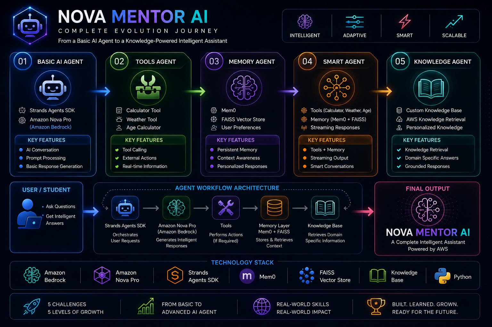

# 🚀 NOVA MENTOR AI

### Complete Evolution Journey from Basic AI Agent to Knowledge-Powered Intelligent Assistant

NOVA MENTOR AI is an end-to-end Generative AI project developed during the **AWS Builders Skill Sprint – Nova Month Challenge**.

This project demonstrates the complete evolution of an AI Agent system — starting from a simple conversational assistant and progressing into an intelligent, memory-enabled, tool-powered, and knowledge-aware AI assistant using **Amazon Bedrock, Amazon Nova Pro, Strands Agents SDK, Memory Systems, Tool Calling, Streaming Responses, and Knowledge Retrieval.**

---

## 🎯 Project Journey

This project was developed step-by-step through five progressive AI challenges.
 
---

## ✅ Challenge 1 – Basic AI Agent

Created a foundational AI assistant powered by Amazon Nova Pro.

### Features

* AI Conversation
* Amazon Nova Pro Integration
* AWS Bedrock Integration
* Prompt Processing
* Intelligent Response Generation

---

## ✅ Challenge 2 – Tools Agent

Enhanced the AI assistant with external tool-calling abilities.

### Tools Added

* Calculator Tool
* Weather Tool
* Age Calculator

### Features

* Tool Calling
* External Actions
* Real-Time Information Processing

---

## ✅ Challenge 3 – Memory Agent

Integrated persistent memory capabilities for personalized interactions.

### Features

* Mem0 Integration
* FAISS Vector Store
* User Preference Storage
* Context Awareness
* Personalized Responses

---

## ✅ Challenge 4 – Smart Agent

Combined AI reasoning, memory, tools, and streaming capabilities.

### Features

* Tools + Memory Integration
* Calculator Support
* Weather Information
* Age Calculator
* Streaming Responses
* Smart Conversations

---

## ✅ Challenge 5 – Knowledge Agent

Developed a complete knowledge-powered AI assistant.

### Features

* Custom Knowledge Base
* AWS Knowledge Retrieval
* Domain-Specific Answers
* Grounded AI Responses
* Intelligent Information Retrieval

---

# 🛠️ Technologies Used

* Amazon Bedrock
* Amazon Nova Pro
* Strands Agents SDK
* Python
* Mem0
* FAISS Vector Store
* Tool Calling
* Knowledge Retrieval
* Streaming Responses

---

# 📂 Repository Structure

```
nova-mentor-ai/

├── Challenge-1/
│
├── Challenge-2/
│
├── Challenge-3/
│
├── Challenge-4/
│
├── Challenge-5/
│
├── screenshots/
│
├── README.md
│
└── .gitignore
```

---

# 🎓 Key Learnings

* Generative AI Agent Development
* AWS Bedrock Implementation
* Amazon Nova Model Integration
* AI Tool Calling
* Persistent Memory Systems
* Vector Database Usage
* Knowledge Retrieval
* RAG Concepts
* Intelligent Assistant Architecture

---

# 🚀 Future Roadmap

* MCP Integration
* Advanced RAG Pipelines
* AWS Documentation Search
* OpenSearch Integration
* Multi-Agent AI Systems
* Enterprise AI Assistants
* Advanced Automation Workflows

---

# 🏗️ Complete Evolution Architecture



---

# 🏆 Achievement

Successfully completed all AWS Builders Skill Sprint Challenges and transformed a basic AI chatbot into a complete **Knowledge-Powered AI Assistant**.

The final system is capable of:

✅ Understanding user queries
✅ Calling external tools
✅ Remembering conversations
✅ Retrieving knowledge
✅ Providing intelligent responses

---

## Built with ❤️ using

**Amazon Bedrock | Amazon Nova Pro | Strands Agents SDK | Python**

🚀 NOVA MENTOR AI – From Simple Agent to Intelligent Assistant
