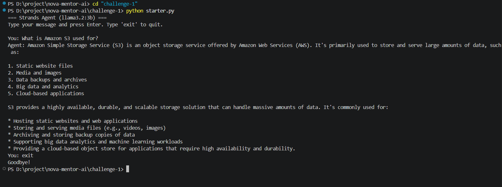
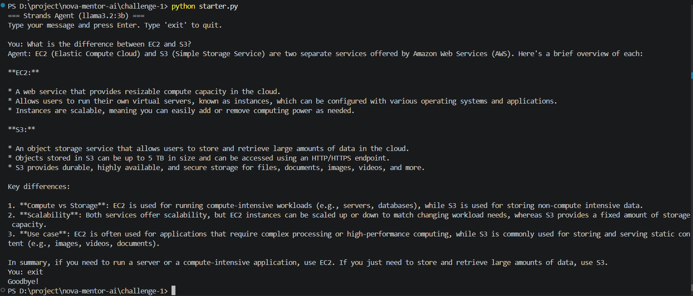

# 🚀 Challenge 1 – NOVA Mentor AI

## Building an AWS Learning Assistant using Strands SDK and Ollama


## 📌 Overview

As part of the AWS User Group Madurai Builders Skill Sprint Challenge, I built **NOVA Mentor AI**, a locally running AI assistant designed to help students learn **AWS Cloud, Generative AI, and modern cloud technologies**.

Unlike traditional AI assistants, this project runs completely on a local machine using **Ollama** and **Llama 3.2 (3B)** without requiring cloud APIs or paid AI services.

The objective of this challenge was to understand the fundamentals of **AI Agents using Strands Agents SDK** and explore how Large Language Models can be integrated into real-world learning assistants.


## 🎯 Challenge Objective

Build a simple AI Agent using:

- Strands Agents SDK
- Ollama
- Llama 3.2 : 3B Model


The agent should:

- Run locally
- Accept user questions
- Generate intelligent responses
- Demonstrate basic AI Agent architecture


## 💡 My Approach

Instead of creating a general chatbot, I developed **NOVA Mentor AI**, an AI learning assistant focused on helping students understand:

- AWS Cloud Computing
- Amazon Web Services Basics
- Generative AI Concepts
- Cloud Career Guidance
- Modern AI Technologies


The assistant works like a personal cloud mentor by explaining technical topics in a simple beginner-friendly way.


# 🏗️ Architecture

```text
User Question
      |
      v

NOVA Mentor AI
(AI Assistant)

      |
      v

Strands SDK Agent

      |
      v

Ollama Runtime

      |
      v

Llama 3.2 : 3B Model

      |
      v

Generated Response
```


## 🛠️ Technologies Used


| Technology | Purpose |
|----------|----------|
| Python | Application Development |
| Strands Agents SDK | AI Agent Framework |
| Ollama | Local LLM Runtime |
| Llama 3.2 : 3B | Language Model |
| VS Code | Development Environment |


## 📂 Project Structure

```text
Challenge-1/

├── starter.py

├── README.md

└── screenshots/

    ├── Architecture.png

    ├── S3.png

    └── EC2-vs-S3.png
```


# ⚙️ Setup Instructions


## Create Virtual Environment

```bash
python -m venv venv
```


## Activate Environment

```bash
venv\Scripts\activate
```


## Install Dependencies

```bash
pip install strands-agents

pip install "strands-agents[ollama]"
```


## Pull Llama Model

```bash
ollama pull llama3.2:3b
```


## Start Ollama Server

```bash
ollama serve
```


## Run AI Agent

```bash
python starter.py
```


# 🧪 Example Questions


### Amazon S3

What is Amazon S3 used for?


### AWS EC2

What is the difference between EC2 and S3?


### AWS IAM

What is an IAM user in AWS?


# 📸 Results

The AI assistant successfully answered AWS and cloud computing related questions using a completely local Large Language Model.


Key achievements:

✅ Local AI inference using Ollama

✅ AWS-focused AI assistant

✅ Fast response generation

✅ No cloud API cost

✅ Beginner-friendly learning experience


## Amazon S3 Question




## Difference Between EC2 and S3




# 🎓 Learning Outcomes

Through this challenge, I learned:

- AI Agent fundamentals
- Running LLM models locally
- Using Ollama with AI applications
- Agent orchestration with Strands SDK
- Building AI-powered learning assistants
- End-to-end GenAI application workflow


# 🚀 Future Improvements

Upcoming improvements:

- Amazon Bedrock Integration
- Tool Calling
- Persistent Memory
- MCP Integration
- AWS Documentation Search
- Multi-Agent System Architecture


# 🏆 Conclusion

This challenge helped me understand how AI Agents work internally.

By combining **Strands Agents SDK + Ollama + Llama 3.2**, I created a local AWS learning assistant that can answer beginner-friendly cloud questions.

NOVA Mentor AI is the first step toward building more advanced AI systems using:

- Amazon Bedrock
- Memory Systems
- Tool Calling
- MCP
- Knowledge Retrieval


# 🏗️ Architecture Diagram


