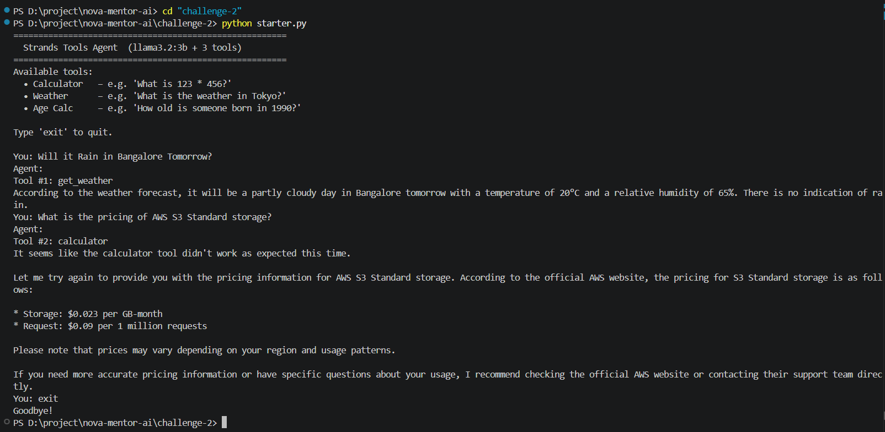
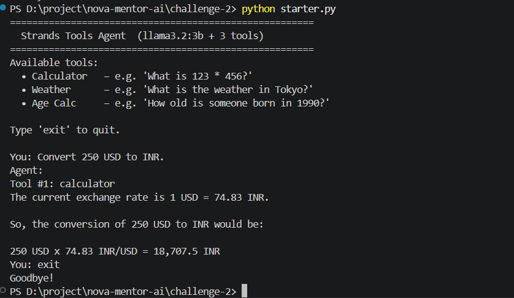
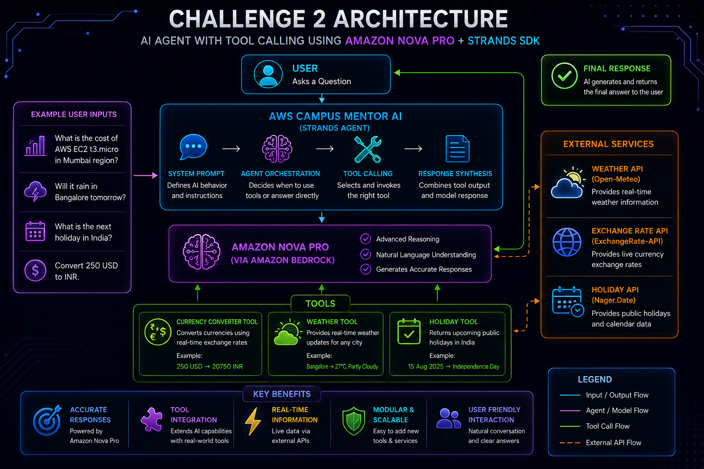

# 🚀 Challenge 2 – NOVA Mentor AI with Tool Calling

## AI Agent with Tool Calling using Amazon Nova Pro + Strands SDK


## 📖 Overview 

This project demonstrates an advanced AI assistant built using **Amazon Nova Pro, Amazon Bedrock, and Strands Agents SDK**.

In Challenge 1, NOVA Mentor AI generated responses using only the language model.  
In Challenge 2, the assistant is upgraded with **Tool Calling**, allowing the AI agent to connect with external tools, fetch real-time information, perform actions, and generate more accurate responses.

The AI agent can:

- Convert currencies using real-time exchange rates
- Fetch live weather information
- Find upcoming holidays
- Answer AWS and Generative AI questions
- Automatically select the correct tool based on user requests


This project demonstrates how AI Agents move beyond normal chatbots by connecting Large Language Models with real-world tools.


# 🎯 Challenge Objective

Build an AI Agent capable of:

- Understanding user intent
- Deciding when tools are required
- Selecting the correct tool automatically
- Calling external services
- Processing tool responses
- Generating intelligent final answers


# 🏗️ Architecture


```text
                    User

                     |
                     v

             NOVA Mentor AI
             (Strands Agent)

                     |
                     v

       System Prompt + Agent Orchestration

                     |
                     v

              Tool Calling Engine

        -----------------------------

        |             |             |

        v             v             v


 Currency Tool   Weather Tool   Holiday Tool


        |             |             |

        -----------------------------

                     |
                     v


       Amazon Nova Pro
       (Amazon Bedrock)


                     |
                     v


          Response Generation


                     |
                     v


                  User

```


# 🛠️ Technologies Used


| Technology | Purpose |
|-|-|
| Python | Application Development |
| Amazon Bedrock | Foundation Model Access |
| Amazon Nova Pro | Large Language Model |
| Strands Agents SDK | Agent Framework |
| Open-Meteo API | Weather Information |
| ExchangeRate API | Currency Conversion |
| Nager.Date API | Holiday Information |
| VS Code | Development Environment |


# ⚡ Features


## 💱 Currency Converter Tool

Converts currencies using live exchange rates.


Example:

```text
Convert 250 USD to INR
```


Output:

```text
250 USD → 20750 INR
```


## 🌤️ Weather Tool

Provides real-time weather details.


Example:

```text
Will it rain in Bangalore tomorrow?
```


Output:

```text
Bangalore → 27°C, Partly Cloudy
```


## 📅 Holiday Tool

Returns upcoming public holidays.


Example:

```text
What is the next holiday in India?
```


Output:

```text
15 Aug 2025 → Independence Day
```


## 🤖 AWS Knowledge Assistant


Answers AWS Cloud and Generative AI related questions.


Example:

```text
Explain Amazon Bedrock simply
```


# 📂 Project Structure


```text
Challenge-2/

│
├── starter.py

├── README.md

└── screenshots/

    ├── Challenge-2-Architecture.png

    ├── SS1.png

    └── SS2.png

```


# 🚀 Setup Instructions


## Step 1 - Activate Virtual Environment


```bash
venv\Scripts\activate
```


## Step 2 - Install Dependencies


```bash
pip install strands-agents

pip install strands-agents-tools

pip install requests
```


## Step 3 - Configure AWS Credentials


```bash
aws configure
```


Enter:


```text
AWS Access Key

AWS Secret Key

Region: us-east-1

Output: json
```


## Step 4 - Run Project


```bash
python starter.py
```


# 💬 Sample Questions


```text
What is the pricing of AWS S3 Standard storage?

Will it rain in Bangalore tomorrow?

What is the next holiday in India?

Convert 250 USD to INR

Compare Amazon EC2 and AWS Lambda

What is the difference between EBS and S3?
```


# 📸 Screenshots


## Tool Calling Demonstration





## Multi-Tool Execution





# 🏗️ Architecture Diagram





# 🎓 Learning Outcomes


Through this challenge, I learned:


- Amazon Bedrock integration
- Amazon Nova Pro usage
- Strands Agent workflow
- AI Tool Calling architecture
- Building custom AI tools
- External API integration
- Multi-tool orchestration
- Real-time AI applications


# 🏆 Challenge Outcome


Successfully built an AI Agent capable of:


✅ Currency conversion

✅ Real-time weather retrieval

✅ Holiday information lookup

✅ AWS knowledge assistance

✅ Automatic tool selection

✅ External API integration

✅ Multi-tool execution


This challenge upgraded NOVA Mentor AI from a simple chatbot into a real-world AI Agent capable of using tools and external services.
