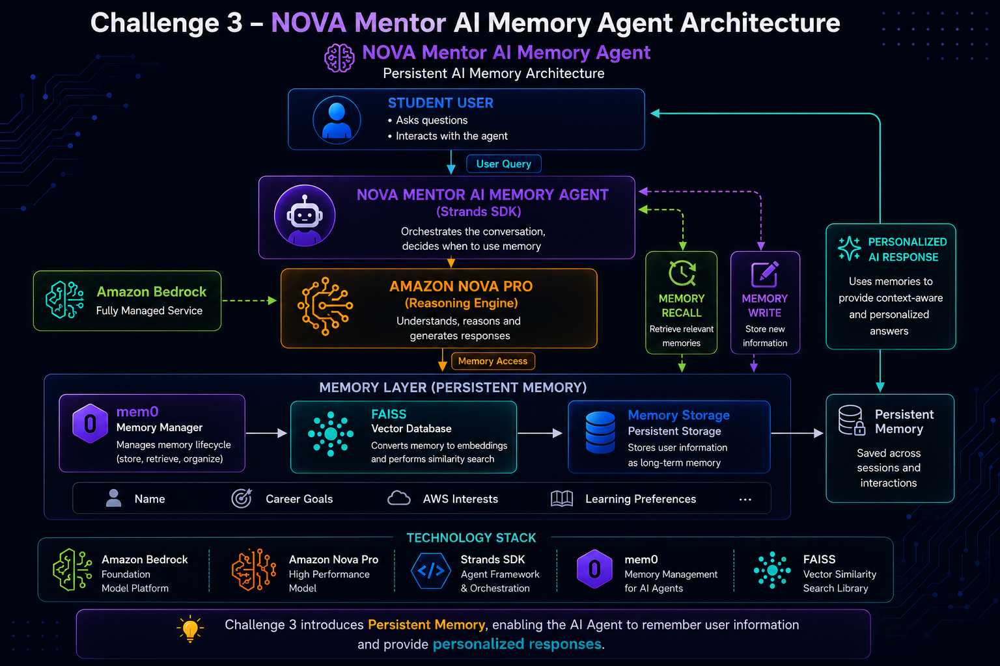

# 🧠 Challenge 3 – NOVA Mentor AI Memory Agent

## Persistent AI Memory Architecture using Amazon Nova Pro + Strands SDK + mem0 + FAISS


# 🚀 Overview

Challenge 3 upgrades **NOVA Mentor AI** by introducing **Persistent Memory capabilities** using **Amazon Nova Pro, Amazon Bedrock, Strands Agents SDK, mem0, and FAISS**.

In previous challenges:

- Challenge 1 introduced a basic AI assistant
- Challenge 2 added Tool Calling capabilities
- Challenge 3 introduces Memory-powered AI interactions


Unlike traditional AI assistants that forget previous conversations, this agent can store user information, retrieve past context, and provide personalized responses across multiple sessions.

This demonstrates how real-world AI assistants remember users and create personalized learning experiences.


# 🎯 Challenge Objective

Build an intelligent AI Agent capable of:

- Saving user information
- Managing conversation memory
- Storing important context
- Retrieving previous interactions
- Understanding user preferences
- Generating personalized AI responses


# 🏗️ Architecture


```text
                 Student User

                      |
                      v

          NOVA Mentor AI
          (Strands Agent)

                      |
                      v


            Amazon Nova Pro
          (Reasoning Engine)


                      |
                      v


              Memory Layer


       --------------------------

       |            |            |

       v            v            v


     mem0         FAISS       Storage


Memory Manager   Vector DB   Persistent
                              Memory


                      |
                      v


          Personalized AI Response

```


# ⚙️ Technologies Used


| Technology | Purpose |
|-|-|
| Amazon Bedrock | Foundation Model Platform |
| Amazon Nova Pro | Reasoning Language Model |
| Strands Agents SDK | Agent Framework |
| mem0 | Memory Management |
| FAISS | Vector Similarity Search |
| Python | Application Development |
| VS Code | Development Environment |


# ✨ Features


## 🧠 Persistent Memory Storage

The AI Agent can remember:

- User name
- Career goals
- AWS interests
- Learning preferences
- Personal study information


Example:


```text
Remember that my name is Thamarai
```


The information is stored inside the memory system for future conversations.


## 🎯 Personalized Learning


The assistant remembers user goals and generates personalized guidance.


Example:


```text
Remember that I want to become a GenAI Engineer
```


Future responses can use this stored information to provide better recommendations.


## 🔍 Memory Recall


The AI can retrieve previously saved details.


Example:


```text
What is my name?
```


The agent searches memory and provides context-aware answers.


# 📂 Project Structure


```text
Challenge-3/

│
├── starter.py

├── README.md

└── screenshots/

    ├── Challenge-3-Architecture.png

    └── Memory Storage.png

```


# 🚀 Setup Instructions


## Step 1 - Activate Virtual Environment


```bash
venv\Scripts\activate
```


## Step 2 - Install Dependencies


```bash
pip install strands-agents

pip install mem0ai

pip install faiss-cpu
```


## Step 3 - Configure AWS Credentials


```bash
aws configure
```


Enter:


```text
AWS Access Key

AWS Secret Key

Region: us-east-1

Output: json
```


## Step 4 - Run Project


```bash
python starter.py
```


# 🧪 Sample Interactions


## Store User Memory


Input:


```text
Remember that my name is Thamarai
```


Output:


```text
Memory stored successfully
```


## Store Career Goal


Input:


```text
Remember that I want to become a GenAI Engineer
```


Output:


```text
Career goal saved successfully
```


## Retrieve Memory


Input:


```text
What is my name?
```


# 📸 Screenshots


## Memory Storage


Stored user information successfully.


# 🔍 Observations


During testing:


✅ Memory storage worked successfully

✅ User information was saved

✅ mem0 Memory Manager worked

✅ FAISS vector database integration worked

✅ Persistent storage enabled context retention


The memory layer allows NOVA Mentor AI to store, organize, and retrieve user information for personalized interactions.


# 🏗️ Architecture Diagram





# 🎓 Learning Outcomes


Through this challenge I learned:


- Persistent AI Memory concepts
- Vector database workflow
- FAISS similarity search
- mem0 framework integration
- Building personalized AI assistants
- Context-aware AI systems
- Long-term memory handling
- Memory based user experiences


# 🚀 Future Improvements


Planned enhancements:

- Advanced memory ranking
- Long-term student profiles
- Personalized AWS learning paths
- Memory optimization
- MCP integration
- Multi-Agent memory sharing


# 🏆 Challenge Outcome


Successfully built an AI Agent capable of:


✅ Remembering user information

✅ Saving user preferences

✅ Persistent memory storage

✅ Vector-based similarity search

✅ Personalized responses

✅ Context-aware conversations


Challenge 3 transformed NOVA Mentor AI into a memory-enabled AI assistant capable of maintaining meaningful user context across conversations.
