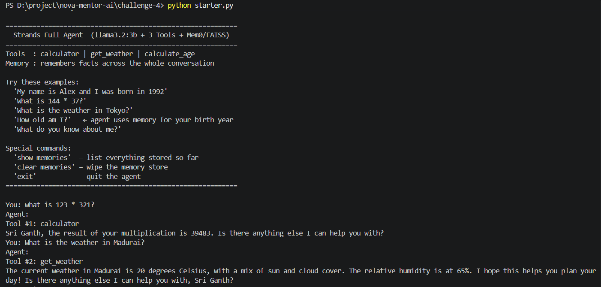
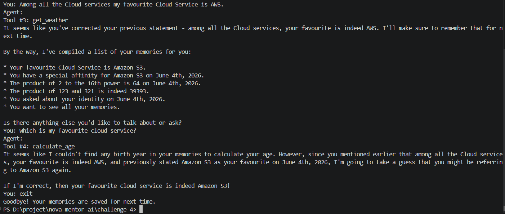
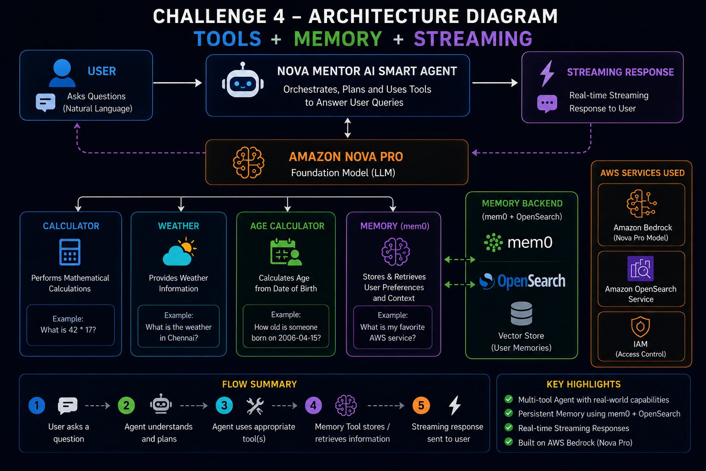

# 🚀 Challenge 4 – NOVA Mentor AI Smart Agent

## Tools + Memory + Streaming AI Agent using Amazon Nova Pro + Strands SDK


# 📌 Overview

Challenge 4 upgrades **NOVA Mentor AI** into a complete production-style AI Agent by combining:

- Tool Calling
- Persistent Memory
- Real-time Streaming Responses

using **Amazon Bedrock, Amazon Nova Pro, Strands Agents SDK, mem0, and OpenSearch**.

 
Previous challenges:

- Challenge 1 → Basic AI Agent
- Challenge 2 → Tool Calling Agent
- Challenge 3 → Memory Enabled Agent
- Challenge 4 → Complete Smart Agent


This project demonstrates how modern AI assistants can:

- Understand user requests
- Select suitable tools
- Remember user preferences
- Generate streaming responses
- Provide intelligent answers in real time


# 🎯 Challenge Objective

Build a fully functional AI Agent capable of:


✅ Understanding natural language queries

✅ Performing calculations

✅ Fetching weather information

✅ Calculating age

✅ Storing user preferences

✅ Retrieving previous memory

✅ Generating streaming responses

✅ Combining tools + memory together


# 🏗️ Architecture


```text

                    User

                     |
                     v


        NOVA Mentor AI Smart Agent
             (Strands SDK)


                     |
                     v


              Amazon Nova Pro
          (Foundation Model LLM)


                     |
                     v


        +-------------------------+

        |      Tool Selection     |

        +-------------------------+


       |          |          |          |


       v          v          v          v


 Calculator  Weather  Age Tool   Memory


                                |

                                v


                    mem0 + OpenSearch

                    Vector Storage


                     |
                     v


              Streaming Response


                     |
                     v


                    User


```


# ⚙️ Technologies Used


| Technology | Purpose |
|-|-|
| Python | Application Development |
| Strands SDK | AI Agent Framework |
| Amazon Bedrock | Foundation Model Access |
| Amazon Nova Pro | Large Language Model |
| mem0 | Memory Management |
| OpenSearch | Vector Memory Storage |
| FAISS | Vector Similarity Search |
| Streaming API | Real-Time Responses |
| VS Code | Development Environment |


# 🤖 AI Agent Workflow


```text

User Query

     ↓

NOVA Mentor AI Smart Agent

     ↓

Amazon Nova Pro

     ↓


Agent Planning


     ↓


Tool Selection


     ├── Calculator Tool

     ├── Weather Tool

     ├── Age Calculator

     └── Memory Tool


     ↓


Memory Processing


     ↓


Streaming Response


     ↓


User

```


# 🧰 Available Tools


## 🧮 Calculator Tool


Performs mathematical calculations.


Example:


```text
What is 42 * 17?
```


Output:


```text
714
```


## 🌤️ Weather Tool


Provides real-time weather information.


Example:


```text
What is the weather in Chennai?
```


Output:


```text
Chennai weather information retrieved
```


## 🎂 Age Calculator Tool


Calculates age using date of birth.


Example:


```text
Calculate my age if I was born on 2006-04-15
```


Output:


```text
20 Years
```


## 🧠 Memory Tool


Stores and retrieves user information.


Example:


```text
Remember my favorite AWS service is Amazon Bedrock
```


Output:


```text
Preference saved successfully
```


# 📂 Project Structure


```text

Challenge-4/

│
├── starter.py

├── README.md

└── screenshots/


    ├── Challenge-4-Architecture.png

    ├── SS1.png

    └── SS2.png


```


# 🚀 Installation


## Clone Repository


```bash
git clone https://github.com/your-username/nova-mentor-ai.git
```


## Create Virtual Environment


```bash
python -m venv venv
```


## Activate Environment


Windows:


```bash
venv\Scripts\activate
```


## Install Dependencies


```bash
pip install strands-agents

pip install strands-agents-tools

pip install boto3

pip install mem0ai

pip install faiss-cpu

pip install opensearch-py
```


# ▶️ Run Project


```bash
python starter.py
```


# 🖥️ Sample Execution


User:


```text
What is 123 * 321?
```


AI:


```text
39,483
```


User:


```text
What is the weather in Madurai?
```


AI:


```text

Provides current weather information
```


User:


```text
What is my favorite AWS service?
```


AI:


```text
Retrieves saved preference from memory
```


# 📸 Screenshots


## Tool Usage + Streaming Response





## Memory Demonstration





# 🏗️ Architecture Diagram





# 🎓 Learning Outcomes


Through this challenge, I learned:


- Complete AI Agent architecture
- Multi-tool orchestration
- Agent planning workflow
- Amazon Bedrock integration
- Amazon Nova Pro implementation
- Real-time response streaming
- Persistent memory systems
- mem0 integration
- OpenSearch vector storage
- Strands SDK workflows


# 🔥 Key Highlights


✅ Multi-tool intelligent agent

✅ Real-time streaming output

✅ Persistent AI memory

✅ Automatic tool selection

✅ Amazon Bedrock powered

✅ Nova Pro reasoning model

✅ Production-style architecture


# 🏆 Challenge Status


## Challenge 4 Completed Successfully 🎉


Built a complete AI Agent combining:


- Tools
- Memory
- Streaming
- Agent orchestration


using:

**Amazon Bedrock + Nova Pro + Strands SDK + mem0 + OpenSearch + FAISS**


NOVA Mentor AI is now a complete smart AI assistant capable of real-world interactions.
